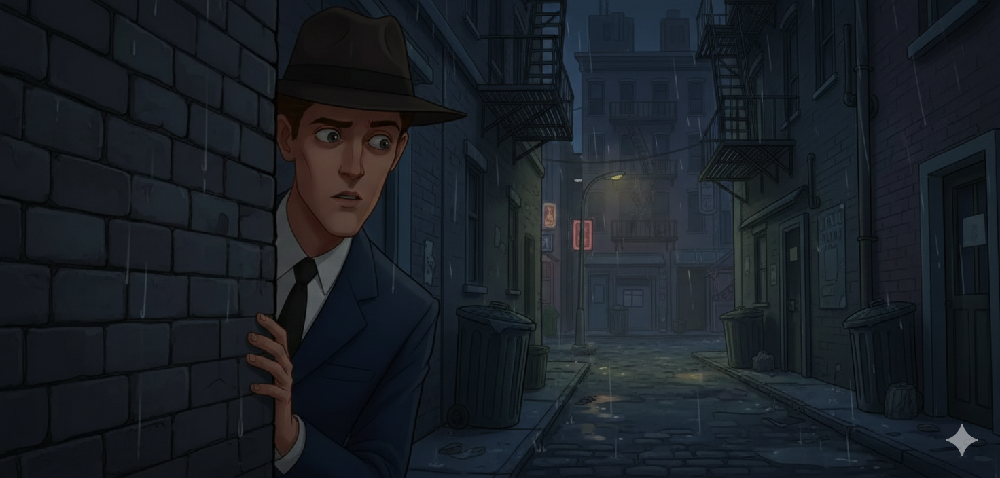
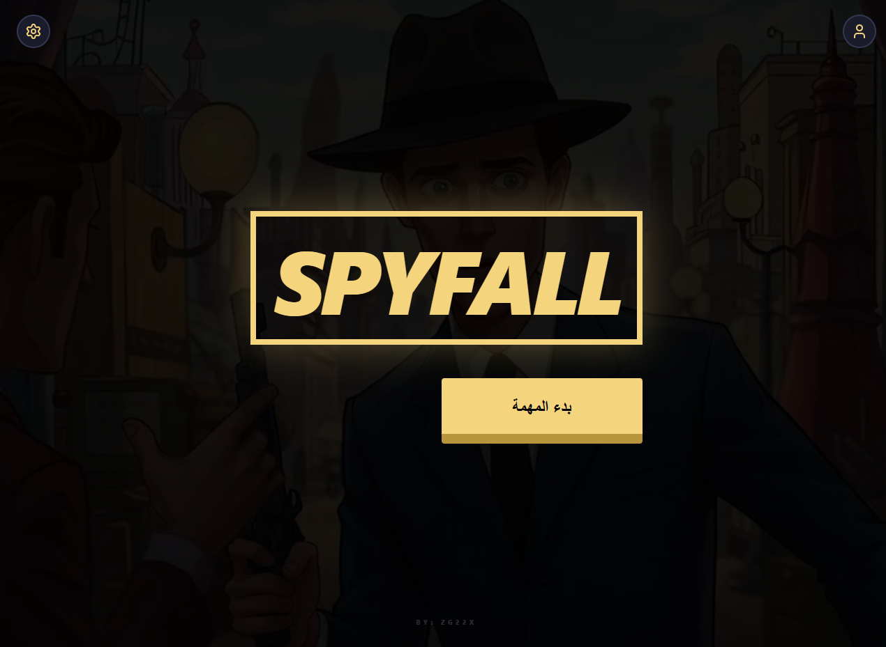
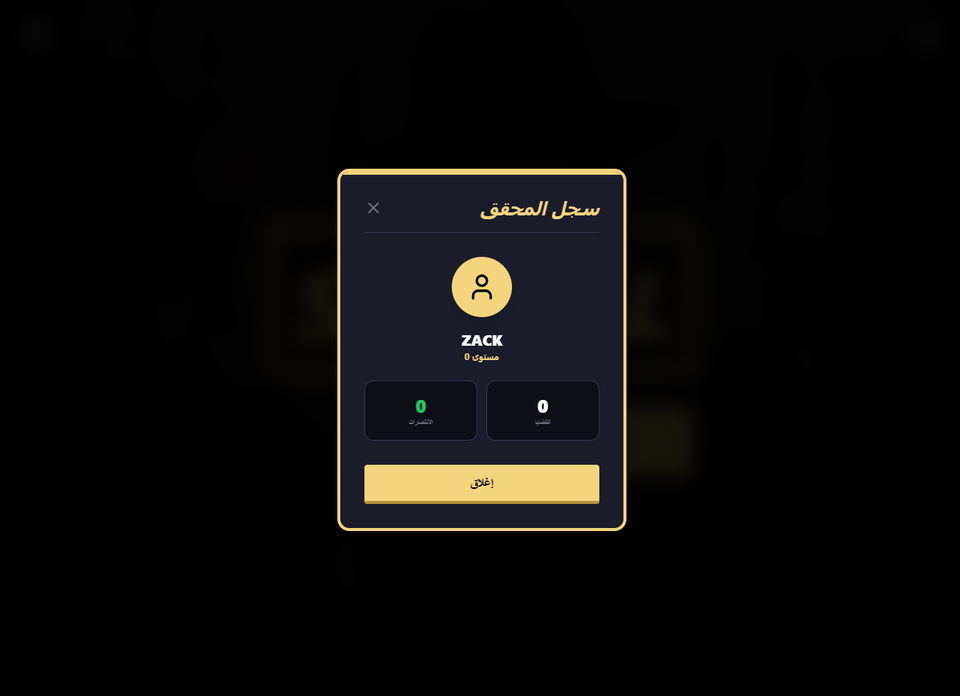
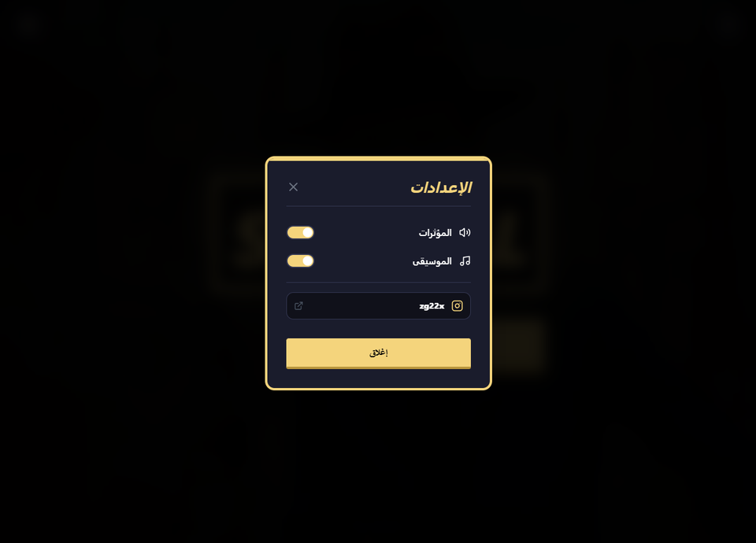

# Spyfall Game

This is a responsive web-based Spyfall game built using React.
It allows players to join a game session and experience the classic Spyfall gameplay in a clean and modern UI.

Purpose of the Project

I built this project to practice:

Building interactive web applications using React

Managing state and game logic

Creating responsive UI with modern tools

Working with component-based architecture

# Technologies Used

React (Vite)

Tailwind CSS

JavaScript (ES6+)

HTML5

Features

Interactive Spyfall game logic

Responsive design (works on mobile and desktop)

Clean and modern UI

Real-time role display (Spy / Location player)

Game session interface

Live Demo

# 👉 https://spy-fall1.netlify.app/

# Screenshot

What I Learned

How to structure a React project professionally

Managing game state using React hooks

Building reusable components

Improving UI design with Tailwind CSS

Debugging and handling project structure issues

## CONTACT HERE

Telegram : @zg22x 

INSTAGRAM : zg22x
